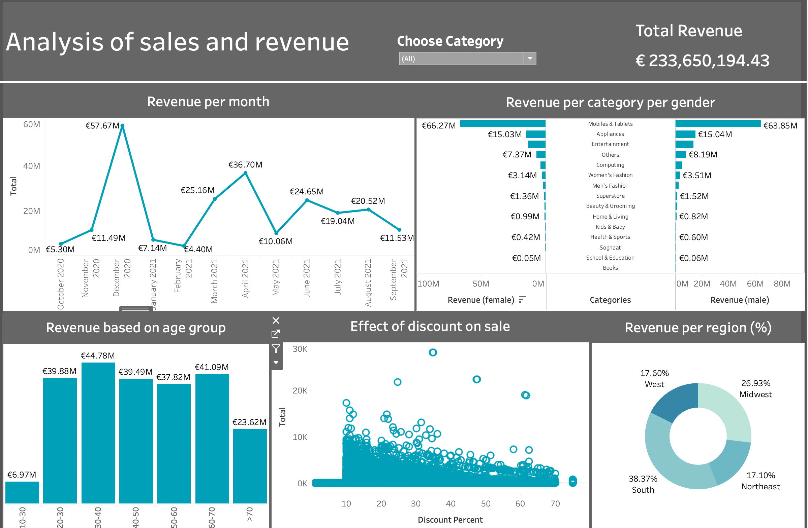

# Dashboard_sales_revenue_analysis

The dashboard is an interactive dashboard that I designed in Tableau and published in Tableau public. 
You can take a look and interact with this dashboard [here](https://public.tableau.com/app/profile/tosin.oyewale/viz/Analysisofsalesandrevenuegenerated/Dashboard1?publish=yes)

 

 

### More information about dashboard
The dashboard that focuses on how certain factors affect revenue generated by the company in question 

e.g month of the year, product category and gender, age group, discount given per sale, and country region. 

You can  interact by selecting or de-selecting certain products and the values are re-calculated for you.

### Data

The data I used to generate the dashboard is in the data folder. Feel free to download it for personal use.
 It contains additional information to be explore. And I will create more dashboard from it in future. 
 For now, I focused only on a single aspect or story. If you need help to make any of the graphs, feel free to reach me on linkedin (see link below)

 I hope I get some time to talk about how I created this dashbord in the nearest future either on medium or youtube or both.

### ------------------------------------------------------
dashboard created by Tosin D. Oyewale (PhD) 
[Linkedin](https://www.linkedin.com/in/tosin-oyewale/) 